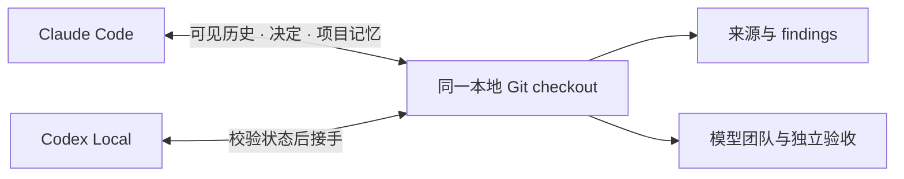

# labkit

在 **Claude Code 与 Codex** 之间共用研究记录、项目记忆和模型团队，并交接同一本地项目。

- **研究记录**：保存来源、精确 findings 与 mem0 索引，检查内容与索引是否失配。
- **模型协作**：每次选择 brains 和 workers，持续执行目标，由所有 brains 独立验收。
- **项目交接**：保存可见对话、目标、决定、想法与下一步，在 Claude Code ↔ Codex 之间接续同一 checkout。



## 在另一台电脑安装

先准备 **Python 3.12+、Git**，以及要使用的 Claude Code / Codex CLI，并在该电脑完成各自登录。命令中的 `python` 必须指向 Python 3.12+；macOS/Linux 可使用 `python3`。

**Claude Code**（在终端执行）：

```text
claude plugin marketplace add JasonZY7/labkit
claude plugin install labkit@labkit
```

**Codex**（在终端执行）：

```text
codex plugin marketplace add https://github.com/JasonZY7/labkit.git
codex plugin add labkit@labkit
```

在重新打开的 Claude Code 会话或新的 Codex task 中加载插件。若只使用其中一个宿主，只需安装对应入口；跨模型执行需要所选模型的本地 CLI 和访问权限。

Windows 的文件回收和测试需要 `pywin32`，使用与 agent 相同的 Python 安装：

```text
python -m pip install pywin32==312
```

核心 controller 与本地 handoff 使用 Python standard library，无需 mem0 账户。需要 cloud memory 时，再安装并配置该电脑的 `MEM0_API_KEY`：

```text
python -m pip install mem0ai==2.0.20
```

源码中的 [requirements.txt](requirements.txt) 与 [requirements-memory.txt](requirements-memory.txt) 提供相同依赖。API keys、CLI 登录、项目 repo、聊天记录和项目记忆均不包含在插件安装包内。

Windows 已完成真实模型协作与双向交接验证。macOS/Linux 有对应的路径、进程和锁实现，但完整原生流程尚未实测；文件回收需要系统提供 `trash` 或 `gio`。完整验证范围见 [VALIDATION.md](docs/VALIDATION.md)。

## 开始使用

| 操作 | Claude Code | Codex |
|---|---|---|
| 初始化研究项目 | `/labkit:lab-init <project>` | `$labkit 初始化研究项目 <project>` |
| 启动或恢复模型团队 | `/labkit:lab-run` | `$lab-orchestrate` |
| 交接当前项目 | `/labkit:lab-handoff 交接给 Codex` | `$lab-handoff 交接给 Claude Code` |
| 检查项目记录 | `/labkit:lab-status` | `$labkit 检查当前项目状态` |

项目交接时，源端先结束本项目的 workers，再生成一条接收指令。将它粘贴到目标界面，目标校验代码状态、读取上下文并接手；Codex 使用 **Local** 环境。当前 handoff 面向同一台电脑的同一个 checkout，不能将交接包复制到另一条路径后直接接收。

历史导出保留实际可见的 user/assistant 文本和来源，读取不到的内容会标明缺口。已记录的决定和想法可继续使用；未记录的内容不会自动恢复。

详细的 team/goal 格式、恢复命令、memory 契约与可选工具，见 [完整使用说明](plugins/labkit/README.md)。`graphify` 与旧 `codex-bridge` 入口属于可选能力，未随本仓库打包；本地 handoff 和多模型 controller 不依赖它们。

## 更新

```text
claude plugin marketplace update labkit
claude plugin update labkit@labkit
```

```text
codex plugin marketplace upgrade labkit
codex plugin add labkit@labkit
```

更新后重新打开会话。旧的 `labkit@local-skills` 或 `labkit@personal` 是独立的本地安装来源；切换来源时可在宿主的插件管理页面停用旧副本，避免重复入口。

## 从源码检查

```text
git clone https://github.com/JasonZY7/labkit.git
cd labkit
python -m pip install -r requirements.txt
python -X utf8 -B plugins/labkit/scripts/lab_selftest.py --offline
```

offline suite 不调用模型或 mem0。可选的 Node.js 用于一项生成的 Workflow script 测试；没有 Node 时会跳过该项。运行不带 `--offline` 的 self-test 会进行 live mem0 检查，需要已有账户配置。

## 仓库结构

```text
.agents/plugins/marketplace.json   Codex 安装入口
.claude-plugin/marketplace.json    Claude Code 安装入口
plugins/labkit/                    两端共享的完整插件
  commands/                       Claude commands
  skills/                         共享 skills
  scripts/                        runtime、检查工具与回归测试
docs/VALIDATION.md                 已验证行为与限制
```

这是从经验证的 labkit 0.7.0 源码整理出的首次公开分发。开发说明见 [HANDOVER.md](plugins/labkit/HANDOVER.md)。
