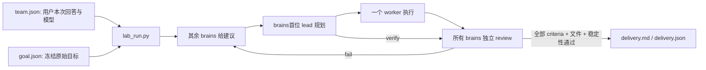

# labkit handover

修改代码前先读本文件。labkit 0.7.0 包含用户可选多模型 controller，以及同一本地 checkout 的 Claude Code ↔ Codex 项目交接；实际版本以本目录的 `.claude-plugin/plugin.json` 和 `.codex-plugin/plugin.json` 为准。

- **源码位置：** 仓库中的 `plugins/labkit/`，即本目录；所有 `python scripts/...` 命令从此 plugin root 执行。
- **安装入口：** [仓库 README](https://github.com/JasonZY7/labkit/blob/main/README.md)，Claude Code 与 Codex 均使用远程 marketplace `labkit`。
- **验证说明：** [公开验证概述](https://github.com/JasonZY7/labkit/blob/main/docs/VALIDATION.md)，记录验证范围与可复现命令。
- **路径边界：** plugin root、目标 project directory 与宿主 installed cache 是不同位置。修改源码不会立即改变已经加载的插件；不要手改 installed cache。

## 产品与记录

四层共用一套项目目录：`raw/` 与 graphify 构成 corpus；`notes/findings/*.md` 保存结论及精确原文；mem0 保存按 kind 标记的改写索引；`handoffs/` 保存完整跨模型交换与 controller 记录。精确事实以 finding file 为记录，mem0 不能替代它。

初始化产生 canonical `AGENTS.md` 与只包含 `@AGENTS.md` 的 `CLAUDE.md`。重复初始化保留已有文件及 `.labkit.json` identity，明确覆盖才用 `--force`。研究工具、memory namespace、source 路由和已有单次 `lab-ask-gpt` 功能继续保留。

## 项目交接协议

[lab-handoff 共享流程](skills/lab-handoff/SKILL.md) 是源端准备、目标端接收、切回与取消的唯一操作说明，包含完整 context/receipt 结构。Claude Code 入口为 `/labkit:lab-handoff`，Codex 入口为 `$lab-handoff`。用户继续使用自己选定的现有界面，将源端 `OPEN_TARGET.txt` 生成的一条指令粘贴到目标界面；目标使用同一 checkout，Codex 使用项目的 Local 环境。现有非 labkit Git repo 可直接交接，不调用 `lab_init.py` 或覆盖其项目规则。

`scripts/lab_handoff.py` 管理 `.labkit-local/transfer-state.json` 和 `.labkit-local/transfers/<id>/`；私有目录的 `.gitignore` 为 `*`，不会更改 `.git` 的配置或原生会话记录。包保存原始目标、约束、决定及明确记录的理由、想法、放弃方案、未决问题、下一步、验证结果和重要文件引用，以及可见会话导出、项目记忆、manifest、接收指令。prepare 时的 context/history/manifest 保持不变，receipt 或 cancellation 作为审计记录追加。每次切换生成新 packet，通过 `previous_handoff_id` 保留前一次交接关系。

源端先确认自己的 CLI/Workflow/subagents 已结束或停止，处理未完成的 native submit/recover，再传 `--source-quiescent`。prepare 持有项目 OS lock 并检查已有 run；`running`、等待 native 工作或验收、以及未解决的 pending 会拒绝。已停止的 interrupted CLI 可保留部分状态交接；目标恢复相同 run 时先检查已有修改和验收，再按 `lab-orchestrate` 选择团队，不能盲目重放 worker 或改写原始 goal。

prepare 前后及 accept 都核对 checkout 路径、Git directory/common directory、HEAD/branch、index、tracked/nonignored untracked 内容。`important_files`、固定项目记录引用和 `handoffs/runs/` 的 state 即使被 Git 忽略也单独校验。accept 还核对当前 handoff ID、目标 host、manifest 和 packet 文件 hashes，以及 receipt 中完全一致的 `objective`、`context_sha256` 和非空 `next_step`。失败不转移 owner；重复提交同一 receipt 可安全重试，旧 packet 不能覆盖更新的交接。

`ready` 时双方 labkit controller 都不能执行；接收后仅允许当前 owner。其他项目写操作先执行 `guard`。普通 shell 的 `LABKIT_HOST` 只按实际宿主为当前命令设置，不改全局环境。这个 guard 是参与者遵守的协作协议，不能拦住未使用 labkit 的外部编辑器或任意进程；source quiescence 和 receipt 都是宿主声明，不是 OS 全局停工或模型理解力的证明。仅当前未接收的 handoff 可取消，保留包并恢复源端 owner，不回滚项目文件。

`scripts/lab_history.py` 只读发现并导出匹配 checkout 的 main session 可见 user/assistant 文本，保留来源、捕获边界和缺口；原生 JSONL/SQLite 不改写，导出不提供原生 `resume`。项目 notes 仍在当前 checkout，Claude auto-memory 只取匹配项目范围，mem0 沿用 `.labkit.json` 的 namespace；缺失 cloud memory 显式记录，不重建或重新索引 rows。Codex global memory 不自动复制，相关决定须由源 agent 明确写入 context。基础交接仅用 Python standard library 与 git，不要求额外的开源 session manager 或 history converter。

Claude auto-memory 必须有可验证的 exact-project main session，且同目录未观测到其他 cwd；目录名 collision 或无来源证据时跳过并记录缺口，包括 Codex 为源端的情况。`check_owner` 按实际 Git root 查状态；controller 拒绝 Git 内嵌套 project 的执行，避免分裂 OS lock 和 native pending reservation。已有嵌套 run 仅可只读检查，不能复制到 root 冒充原 run。

## Format 2 controller

`skills/lab-orchestrate/SKILL.md` 是 Claude Code、Codex、本地 ChatGPT 的共享执行流程，Claude command 为 `/labkit:lab-run`。command 不固定 model frontmatter。每次新启动或用户恢复先确认一个/多个 brains、一个/多个 workers 及 exact model IDs；当前请求已明确选择则不重问。内部 submit 循环不再询问。



`team.json` 有 `selection`、`brains`、`workers`；每个成员有唯一 `id`、`provider`、完整 `model` 和可选 `effort`。两组各至少一个成员，provider 支持 `codex` / `claude`。首位 brain 是 lead，其余先做 advisor，全部独立 review。workers 共用项目目录且逐个执行；不是并行写同一工作树。

`goal.json` 有 `objective`、非空 `acceptance: [{id, text}]` 与非空 `deliverables`。目标保留原始 scope；交付物必须为项目内文件，不能指向 `handoffs/runs/`。示例仅维护在 [README](README.md#启动示例)。创建 run 后不重写 goal 来迎合结果。

```text
python scripts/lab_run.py run --directory PROJECT --goal-file GOAL.json --team-file TEAM.json
python scripts/lab_run.py status RUN_DIRECTORY
python scripts/lab_run.py resume RUN_DIRECTORY --reuse-team
python scripts/lab_run.py resume RUN_DIRECTORY --team-file TEAM.json
```

run 保存于 `PROJECT/handoffs/runs/<timestamp>-<random>/`：`state.json`、`goal.json`、`team.json`、历次选择、带序号 prompt/schema/result、Workflow input 和 events。planner 的 `verify` 只是申请验收；worker 无权确认最终完成。

只有每个当前 brain 都独立覆盖每个 acceptance ID、逐项给出证据且全部 `pass`，无 unresolved issues，所列 deliverables 实际存在，并通过 review 前后 snapshot 比较，才写 `delivery.md` / `delivery.json`。snapshot 对普通项目文件用 metadata，对交付文件用 SHA256；排除 dependency/cache/controller 目录。它检测一般并行改动，不是 adversarial integrity 或零 bug 保证。

### 执行路径与身份

| Provider / 宿主 | 路径 | 角色权限 |
|---|---|---|
| `codex` / 任一本地宿主 | 本地 Codex CLI，指定用户 model/effort | brains `read-only`；workers `workspace-write` |
| `claude` / Codex 或本地 ChatGPT | 本地 Claude CLI，指定用户 model/effort | brains 使用 plan/read tools；workers 保留 auto 原生权限 |
| `claude` / Claude Code | 原生 `Workflow` 单个 agent，指定完整 model/effort | 非 worker `Plan`；worker `general-purpose` |

保留 `CLAUDECODE` 和 `LABKIT_ROLE` guards。Claude 内不能清除 nesting guard 再启动 nested Claude CLI。`doctor` 仅检查 CLI/认证，`catalog` 为配置提示；两者都不调用模型，也不证明完整账户 entitlement。只需满足所选 provider 的依赖。

Claude CLI 从实际 assistant events 核对 model，保留 fallback 与不匹配的失败证据。当前 Codex JSONL 缺少独立 response model 时，保存 requested model，诚实记录 `identity_verified: false`。原生 Claude 以实际 subagent transcript 校验；effort 记录是 request evidence，不能声称独立确认了实际计算量。

### 原生 Workflow 提交

Exit `4` / `awaiting_host` 时读取 controller 生成的整个 `.workflow.json`，直接作为 `Workflow` 输入。新请求生成 `.workflow.js`，内嵌 exact prompt、model、effort 和 agentType；`.workflow.json` 只保存 `{"scriptPath": "<该 script 的绝对路径>"}`。host 传递短路径，无需读取或重构完整 history/prompt JSON，避免额外转义、截断和传输 tokens。记录 Workflow ID，等待同一个 Workflow 完成，不重复派发。当前主会话模型不代表 agent 的实际模型。

已有 pending 的 `.workflow.json` 不重写：若仍采用 `script` + `args`，原样提交即可。该旧格式的 `args` 是 JSON string，原脚本使用 `JSON.parse(args)`，宿主应原样传递。

将 agent 完整最终 assistant text 原样保存为 report file，不能只摘 JSON，也不能添加包装。内置 `Plan` 可能在 JSON 外加入说明和 `Critical Files` footer，这些都属于要保留的原文。真实 transcript 通常在 `~/.claude/projects/<project>/<session>/subagents/workflows/<workflow>/agent-*.jsonl`，也可能使用 `CLAUDE_CONFIG_DIR` 指定的 config root。只读取实际 runtime 文件，不创建、改写或复制一份来充当证明。

```text
python scripts/lab_run.py submit RUN_DIRECTORY --artifact EXACT_ARTIFACT --report-file REPORT --transcript-file TRANSCRIPT
```

`lab_native.py` 校验 config 内真实 subagent path、session/agent identity、pending token 在 user prompt 中出现、之后每条 assistant 的 exact model，以及 final text 与 report 一致。还核对同目录 agent `.meta.json` 的 model/agentType 和 `journal.jsonl` 中对应 agent 的最终 `result`、此前匹配的 `started` key 与 result text，避免尚在执行时提前提交。保存 transcript/metadata/journal 的 SHA256 和身份来源；这不是对本地文件篡改的认证。过期 artifact、错误模型、伪装 final text 或缺失完成记录必须拒绝。format 2 不接受旧的 `--host-model` 自报。

完整原文通过 transcript/journal 校验后，controller 才为 planner/reviewer 解析直接 JSON，或提取唯一标记为 json 的代码块；多个 JSON 块或模糊输出拒绝。提取结果仍走相同 strict schema、team 和 acceptance criterion gates。result 同时保存原始 `text` 与 `structured_output`；host 不负责剪裁或修正模型输出。报告通过 verify + parse 是中间步骤，不能代替完整 goal 的独立验收。

`submit` 自动继续 controller，新的 `awaiting_host` 再处理新请求。旧请求通过 `resume` 只返回同一 artifact，不 dispatch、不增加预算；未解决的 pending 不能换团队。

### 中断、预算、无进展与取消

新 run 默认 `max_rounds=4` 个 cycle，call budget 为 `max_rounds * (2 * brains数量 + 2)`，`stall_limit=2`。`--timeout` 只对本地 CLI 调用实施 hard timeout，默认 1,200 秒。原生 `Workflow` 的公开 agent 契约没有 timeout/AbortSignal，不受该 CLI 参数硬限制；需要停止时由宿主使用 `TaskStop`，然后执行下述恢复。预算在 dispatch 前计入，包含中断尝试。`worker_turns` 记录已派发 worker 尝试，`cycles` 是循环预算的计数；不要混称完成任务数。

CLI 中断保留 pending、prompts、实际输出和预算。恢复先由 brains 检查部分改动再规划，不盲目重跑 worker。原生 Workflow 成功必须提交真实最终文本；失败/中断且不能有效提交时，宿主先观察 Workflow 已结束/失败，或用原生 `TaskStop` 停止它，确认没有继续执行后再恢复：

```text
python scripts/lab_run.py recover RUN_DIRECTORY --artifact EXACT_ARTIFACT --reason "实际错误和已确认的部分改动" --workflow-stopped
python scripts/lab_run.py cancel RUN_DIRECTORY --reason "具体取消原因"
```

`recover` 仅处理当前 `awaiting_host` 的精确 artifact，保留原 pending/reason 到 history 与 interruption，已用预算不退，转回建议/规划以检查 partial state。`--workflow-stopped` 是宿主基于观察作出的确认，Python 不负责停止原生 Workflow。取消前同样先停止任务；`cancel` 保留全部证据并释放项目保留状态，已取消 run 不可恢复。

`paused` 或 `blocked` 的用户恢复授予新预算。`no_progress` 必须先检查 reviews、决定新做法，再用 `--reset-stall`。活动或未决 run 对项目的保留状态不能靠删除 lock/state 绕过。

`run` / `resume` / `submit` exit contract：`0` complete，`1` interrupted/error，`2` blocked，`3` paused，`4` awaiting_host。`status` 的 `0` 只表示成功读出记录。format 1 历史 run 仍以旧固定角色工作，用 `--reuse-team` 恢复；旧原生提交通过 `lab_run_legacy.py submit`。不能把 format 2 配置强套旧记录。

## Finding 与 mem0 不变量

finding file 是记录，mem0 rows 是索引。mem0 会改写和拆分文本；文件修订后，旧 rows 若仍携带指向新文件的 source，就会用正确引用支持旧主张。每个 `lab_mem.py` guard 都在防止这种静默失配。修改时要核对：文件与 rows 是否可能不一致却没有报告。

hash 证明文件自盖章后未变，不证明 rows 描述当前版本。完整 supersede、per-call `capture_id`、确认异步删除后才注销、失配 sentinel、file pointer 检查和双向 status 都保留在 scripts。详见 README 与现有 regressions，不能把这些检查改成只靠 command prose。

## 验证与证据范围

```text
python scripts/lab_selftest.py --offline
python scripts/lab_run.py doctor
```

offline suite 自动发现 `scripts/test_lab_*.py`，覆盖 scaffold、CLI adapters、controller、native verification、history、handoff、capture/status 与 frontmatter；不需要 API key。CI 使用这条离线路径。测试创建一次性本地 fixtures，清理遵循回收规则，因此仍需下节列出的平台回收依赖。

`doctor` 仅检查 CLI 与认证。明确需要验证真实 mem0 时才运行 `python scripts/lab_selftest.py`；这会在一次性 namespaces 实际调用 extraction、filtering、索引与删除，完成后清空。无法依赖正常在线服务稳定制造的失败场景由 offline regressions 覆盖。

版本验证、历史功能覆盖和双向 handoff 的概述统一见 [公开验证说明](https://github.com/JasonZY7/labkit/blob/main/docs/VALIDATION.md)。应保留实际命令、结果与未验证范围；单条解析成功、CLI 已登录或先前版本通过，不能替代当前代码和目标环境的验证。

## 安装与发布边界

普通安装使用仓库的远程 marketplace，命令见 [插件 README](README.md#安装与命令)。完整环境准备和发布配置由 [仓库 README](https://github.com/JasonZY7/labkit/blob/main/README.md) 维护。两个 manifests 的版本应保持一致；验证后通过仓库的 marketplace 发布，再由宿主更新已安装插件并重新加载。

`scripts/deploy.py` 仅保留为旧 maintainer 的本地 marketplace helper。它有固定的本地 marketplace 名称与目录，普通用户安装、远程 marketplace 发布和 CI 都不使用它。该 helper 默认还会运行真实 mem0 self-test；不能把它当成通用离线 installer。

安装副本、开发 checkout 与用户项目相互独立。发布内容包括 manifests、commands、skills、runtime scripts、tests 和可公开的文档；项目交接包、会话日志、个人配置与凭据不属于插件源码。

## 运行依赖与平台差异

基础运行需要 Python 3.12+ 和 git，controller 与本地 handoff 使用 standard library。memory layer 另需 `mem0ai` 与 `MEM0_API_KEY`。Windows 测试清理和文件回收需要 `pywin32`；其他平台需要 `trash` 或 `gio`。回收依赖不可用时保留文件并明确失败，不降级为永久删除。

Windows 上 `lab_mem.py` 可从 `HKCU\Environment` 读取 `MEM0_API_KEY`，处理运行中进程未继承后来设置变量的情况。用 `lab_mem.py doctor` 检查当前来源与认证，不输出 key。

所选 provider 必须有可用的 CLI、认证和模型；Claude Code 内执行 Claude 角色需要原生 `Workflow`。宿主没有该工具时应报告能力缺口，不能清除 nesting guard 后启动 nested CLI。Windows sandbox 设置随 run 保存；遇到 1385 等实际失败时再检查权限和兼容配置，不能据其他机器的历史结果推断本机能力。

graphify 与 codex-bridge 是可选外部工具，没有随插件打包。graphify 会受 `.gitignore` 影响，因此 scaffold 有意跟踪 `raw/`。只读 brains 直接读 graph JSON，workers 执行可能初始化 cache 的 CLI。notes 始终是普通 Markdown，Obsidian 与 Zotero 不是必需依赖。

## 实测 mem0 契约

这些调用约定由 scripts 与 regression checks 保留；model doctor 不会重测远程 mem0 行为。修改相关 guards 前应检查对应 service 行为。

| 行为 | 代码后果 |
|---|---|
| `add()` / `delete_all()` flat `user_id=`；`search()` / `get_all()` nested `filters={"user_id": ...}` | 错误 delete_all shape 报 400；错误 search shape 可能静默返回整个 namespace。 |
| metadata filtering 仅 `filters={"AND": [{"user_id": u}, {"metadata": {"kind": k}}]}` 生效 | 单独 `metadata=` 被接受但忽略，未过滤结果看似已过滤。 |
| `add()` 异步拆 rows 且不同步出现 | 连续两次稳定 id diff 加 per-call `capture_id` metadata 匹配。 |
| `delete()` / `delete_all()` 异步 | 2xx 仅接受；观察 row 消失后才确认。 |
| extraction 可无错误地存零 rows，同一输入不稳定 | `capture` 非零退出并说明未索引。 |
| extraction 返回 cp1252 无法打印的 Unicode | 写入后才报错；两个 scripts 使用 UTF-8 stdout。 |
| mixed namespace 的 semantic score 不可靠 | 使用 `recall --kind` 缩小范围，并回到 finding/source 核查；不单独信 score 排名。 |

## 已知限制

1. mem0 无写入 completion signal，两次稳定 poll 是有限观察，不能证明全部 split rows 已到齐。
2. `write_mem0_rows` 是未加锁的 read-modify-write；`expect_hash` 缩小窗口、atomic write 防半写，但并发修订同一 finding 仍可能丢更新。
3. legacy rows 可能缺 finding pointer；仅 DOI 或无 source 时不能可靠定位被删除文件，需重新 capture 加 `--finding-file`。未做远程 migration。
4. `--allow-orphans` 有意允许保留旧 rows，但 status 持续报告 drift。
5. 模型 reviews、项目 snapshot 和本地 transcript 都有各自证据边界；不能宣称零 bug、完整模型 entitlement 或防本地篡改。

## 代码入口与手动审查

| 文件 | 职责 |
|---|---|
| `scripts/lab_mem.py` | mem0 API、frontmatter 与全部写删 guards |
| `scripts/lab_init.py` | scaffold 与确定性 drift checks |
| `scripts/lab_models.py` | 可选 provider/model 的 CLI adapters、doctor、catalog |
| `scripts/lab_native.py` | 原生 runtime transcript 校验 |
| `scripts/lab_run.py` | format 2 state、team/goal、dispatch/review/delivery、恢复与取消 |
| `scripts/lab_run_legacy.py` | format 1 兼容和共享 lock/state helpers |
| `scripts/lab_handoff.py` | 本 checkout 私有交接、状态指纹、ownership、接收与取消 |
| `scripts/lab_history.py` | 按 checkout 只读发现和导出 Claude/Codex 可见历史 |
| `scripts/lab_selftest.py`、`scripts/test_lab_*.py` | offline regressions 与真实 mem0 integration |
| `commands/*.md`、`skills/labkit/SKILL.md` | Claude recipes 与共享四层路由 |
| `skills/lab-orchestrate/SKILL.md`、`commands/lab-run.md` | 共享协作协议及 Claude 入口 |
| `skills/lab-handoff/SKILL.md`、`commands/lab-handoff.md` | 共享项目交接流程及 Claude 入口 |

```text
python scripts/make_review_prompt.py --out review.md
```

这会汇集 handover、脚本、regressions 和 review brief 成一份 self-contained prompt，保留 reviewer 实际见过的上下文。可用 `--focus "具体审查范围"`。若已安装 codex-bridge，先按该 skill 确认实际脚本路径，再使用其 PowerShell 接口：

```powershell
& "<installed-codex-bridge>/scripts/codex-bridge.ps1" `
  -Mode ask -PromptFile "<abs path to review.md>" -Effort high -KeepArtifacts
```

请求具体缺陷、证据和未验证范围，并保存完整答复。该工具只是可选审查入口；生成的 prompt 也可交给用户选定的其他可用审查工具。
