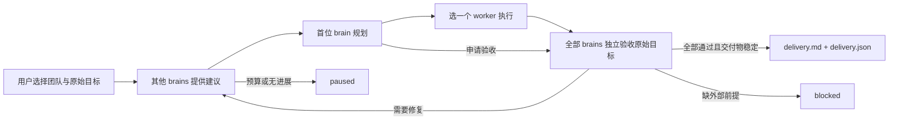
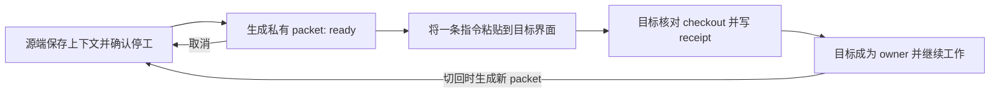

# labkit

labkit 是 Claude Code、Codex 和有本地工具的 ChatGPT 共用的研究工具包。它保存来源、精确笔记、mem0 索引和模型协作记录，并用用户每次选择的团队持续执行目标、修复问题和独立验收。

Claude Code 使用 `/labkit:lab-run`，Codex 使用 `$lab-orchestrate`。每次新启动或用户主动恢复，先选择一个或多个 **brains**、一个或多个 **workers** 及各自的 exact model ID；本次请求已明确选择时直接沿用。角色不绑定 Astra 或 Opus，内部执行和提交循环也不反复询问团队。



`brains[0]` 是 lead，其他 brains 是 advisors；**所有 brains 都是独立 reviewers**。lead 每次将一个有明确边界的任务交给一个 worker。所有成员共享项目文件，因此 workers 按顺序执行。交付要求所有 brains 逐项通过原始 acceptance criteria，所列交付文件实际存在，且 review 期间项目稳定性检查通过。review 失败进入修复；达到预算或调用中断保留未完成状态。

## 在 Claude Code 与 Codex 之间交接项目

`lab-handoff` 让你在现有两个界面之间接续同一本地 Git checkout。源 agent 整理项目记录，用户将生成的一条指令粘贴到自己选定的目标界面，目标 agent 核对并接手。

| 当前源界面 | 发起指令 |
|---|---|
| Claude Code | `/labkit:lab-handoff 将当前项目交接给 Codex` |
| Codex | `$lab-handoff 将当前项目交接给 Claude Code` |



源 agent 先结束或停止本项目的 workers，处理未提交的 native report，再保存原始目标、约束、决定及已记录的理由、放弃的方案、想法、未决问题、下一步和验证结果。已有非 labkit Git repo 也可使用，无需运行初始化或改写它的 `AGENTS.md`、`CLAUDE.md`。完整 context 结构和命令只维护在 [lab-handoff 共享流程](skills/lab-handoff/SKILL.md)。

交接包保存在本 checkout 的 `.labkit-local/transfers/<id>/`，该私有目录用自己的 `.gitignore` 忽略全部内容。包内包含 `context.json`、`BRIEFING.md`、可见会话文本、项目记忆引用／快照、manifest 和 `OPEN_TARGET.txt` 中的一条接收指令。将这条指令原样粘贴到目标 Claude Code 或 Codex 界面；Codex 使用该项目的 Local 环境。切回时当前 owner 准备新包，`previous_handoff_id` 将历次交接串联起来。

接收时必须仍是同一 checkout：校验项目路径、Git directory/common directory、HEAD/branch、index、tracked 与未被忽略的 untracked 文件；明确列出的 `important_files`、已引用的项目记录和已有 run 状态即使被 Git 忽略也会检查。原有未提交修改保留。目标 agent 读取记录后，提交包含原始 `objective`、具体 `next_step` 和 `context_sha256` 的 receipt，成功后复述目标、关键决定及下一步再继续。工作区已变化、交接包被修改或包已过期时，接收失败且不转移执行权；应取消旧包后重新准备。

交接脚本只读原生会话存储，导出范围是实际发现的本项目可见 user/assistant 文本；项目 notes 留在原处，Claude auto-memory 和可用的项目 mem0 rows 按范围保存。未捕获的内容记录为缺口，Codex global memory 不自动复制。交接不会改写原生历史、创建原生 `resume` 会话或重建 mem0 namespace，也不需要额外安装会话迁移工具。

Claude auto-memory 的目录必须有可验证的本项目会话，且没有观测到其他 cwd；目录名冲突或来源无法核实时跳过并报告。Git 项目的 labkit controller 必须从 checkout root 执行；已有嵌套 project/run 可只读检查，执行会明确拒绝，避免形成另一套锁和执行权。

`ready` 期间两端的 labkit controller 都拒绝执行；接收后只允许当前 owner 执行。其他项目写操作按共享流程先运行 `guard`。这是参与者遵守的 ownership 协议，无法阻止未使用 labkit 的编辑器或进程。`--source-quiescent` 表示源 agent 已观察到本次工作停止，receipt 表示目标已确认上下文；两者都不是 OS 全局停工或模型理解力的独立证明。取消保留记录并恢复源端 owner，不回滚代码。

## 启动示例

以下只展示文件格式，实际模型由用户本次选择。将两个文件保存在目标项目中。

`team.json`：

```json
{
  "selection": "示例选择：Astra 和 Sonnet 4.6 作为 brains，Opus 5 作为 worker。",
  "brains": [
    {"id": "lead", "provider": "codex", "model": "gpt-6-astra", "effort": "max"},
    {"id": "critic", "provider": "claude", "model": "claude-sonnet-4-6"}
  ],
  "workers": [
    {"id": "builder", "provider": "claude", "model": "claude-opus-5"}
  ]
}
```

`selection` 记录实际用户回答；每组至少一个成员，可添加更多成员。`id` 全局唯一，provider 为 `codex` 或 `claude`，model 使用完整 ID，不能用 `opus`、`sonnet`、`inherit` 等别名。省略 `effort` 使用原生默认设置，指定时由所选 provider 检查是否支持。CLI 登录或 `catalog` 列出的提示不证明账户能使用所有模型。

`goal.json`：

```json
{
  "objective": "修复现有计费函数的整数求和错误，保持函数签名和已有测试内容不变，并记录验证结果。",
  "acceptance": [
    {"id": "correctness", "text": "原有全部测试通过，报告列出实际执行命令及结果。"},
    {"id": "scope", "text": "函数签名和已有测试内容保持不变，修复仅涉及该错误。"}
  ],
  "deliverables": ["billing.py", "verification.md"]
}
```

`objective` 保留原始目标及限制；`acceptance` 为非空的 `{id, text}` 列表；`deliverables` 为非空项目相对文件路径，不能指向 controller 自身记录。创建 run 后目标冻结，后续计划不能降低标准或用完成局部任务替代原始目标。

```powershell
python scripts/lab_run.py doctor
python scripts/lab_run.py catalog
python scripts/lab_run.py run --directory "<project>" --goal-file "<project>/goal.json" --team-file "<project>/team.json"
python scripts/lab_run.py status "<run-directory>"
python scripts/lab_run.py resume "<run-directory>" --reuse-team
python scripts/lab_run.py resume "<run-directory>" --team-file "<project>/team.json"
```

命令中的 script path 相对本源码目录；已安装插件会自行解析其绝对路径。新项目先运行 `lab_init.py init`。`doctor` 只检查 CLI/认证；真实协作会消耗所选模型 usage。`catalog` 提供 provider 检查和配置提示，允许自定义完整 model ID，不是完整模型或 entitlement 清单。

默认预算为 4 个规划/验收 cycle、`4 * (2 * brains数量 + 2)` 次模型调用。`--max-rounds`、`--max-calls` 调整调用预算；`--timeout` 是每次本地 CLI 调用的 hard timeout，默认 1,200 秒。原生 `Workflow` 不受该参数硬限制，其公开 agent 契约没有 timeout/AbortSignal；需要停止时由宿主使用 `TaskStop`，再按恢复流程处理。新 run 的 `--stall-limit` 默认 2。模型调用在派发前计入，包括中断的尝试。预算耗尽或连续无进展为 `paused`；未完成不能宣称交付。

## 宿主与恢复

| 所选 provider | Claude Code 内 | Codex / 本地 ChatGPT 内 |
|---|---|---|
| `codex` | 本地 Codex CLI | 本地 Codex CLI |
| `claude` | 原生 `Workflow` 单个 agent，指定完整 model ID 与 effort | 本地 Claude CLI |

Claude 原生请求返回 `awaiting_host` 和 `.workflow.json`。新请求的 JSON 是短对象 `{"scriptPath": "<绝对路径>.workflow.js"}`；配套 script 已内嵌 exact prompt、model、effort 和 agentType。入口将整个 JSON 原样交给 `Workflow`，无需读取或重构长 prompt，再等待同一 Workflow，保存 agent 完整原始最终文本，并用 `submit --artifact --report-file --transcript-file` 自动提交。controller 将报告绑定到 pending token、实际 transcript 中的 model 和最终文本；不会使用主会话自报模型替代证据。原生 `Plan` 可能在 JSON 外附加说明和 `Critical Files` footer，host 必须完整保留，不能只摘 JSON 或添加包装。controller 先核验完整文本，再从直接 JSON 或唯一标记为 json 的代码块提取结构，执行相同 strict schema/criterion gates，并同时记录原始 `text` 与 `structured_output`；多个 JSON 块或模糊结构会被拒绝。已有 pending 的 `.workflow.json` 原样沿用。Claude brains 使用 `Plan`，worker 使用 `general-purpose`；保留 `CLAUDECODE`，不能启动 nested Claude CLI。

`resume` 必须明确 `--reuse-team` 或 `--team-file`，且 pending 请求解决前不能换团队。原生 pending 的恢复返回同一请求，不重复派发、不增加预算。成功的原生 Workflow 提交真实 transcript；失败或中断时，先确认 Workflow 已结束或通过原生停止工具终止它，再用 `recover` 保存部分进展和实际错误，让 brains 检查项目后决定下一步：

```powershell
python scripts/lab_run.py recover "<run-directory>" --artifact "<pending-artifact>" --reason "<已确认的部分改动和实际中断原因>" --workflow-stopped
python scripts/lab_run.py cancel "<run-directory>" --reason "<取消原因>"
```

`--workflow-stopped` 必须基于实际观察，不能用它假定任务已停止。CLI 中断恢复同样先检查部分改动，不盲目重放 worker。`paused` / `blocked` 的用户恢复授予新预算；无进展暂停需先选择新做法再加 `--reset-stall`。`cancel` 前也要停止仍在运行的 Workflow/CLI；它保留所有证据、释放项目保留状态，取消后不能恢复。

run 记录在 `handoffs/runs/<run-id>/`，包含冻结 goal、team、历次选择、prompts、model attribution、results、events 和 `state.json`。成功时生成 `delivery.md` / `delivery.json`，其中记录交付文件 SHA256 和所有独立 reviews。完整操作与 exit codes 见 [lab-orchestrate](skills/lab-orchestrate/SKILL.md)。旧 format 1 run 保留历史协议，不使用新 team 配置。

Windows 可显式指定 `--windows-sandbox elevated|unelevated`，设置随 run 保存；Codex brains 使用 `read-only`，workers 使用 `workspace-write`。`unelevated` 是处理 Windows 1385 的兼容选项，隔离比 `elevated` 弱；不会自动切换、改 ACL 或禁用 sandbox。见 [Windows sandbox 说明](https://learn.chatgpt.com/docs/windows/windows-sandbox)。Claude 权限模式保留宿主检查，不能表述为 OS sandbox。

## 四层研究记录

| Layer | 位置 | 回答的问题 | 工具 |
|---|---|---|---|
| corpus | `raw/` → `graphify-out/` | 来源说了什么、来源间如何关联 | graphify |
| notes | `notes/` | 我们得出了什么结论、原文证据是什么 | Markdown + git |
| memory | mem0 `proj-<slug>` | 约束、决策、偏好 | mem0 cloud |
| collab | `handoffs/`、`.labkit-local/transfers/` | 模型做了什么、怎样审查与验收、项目如何交接 | 共享 controller、lab-handoff；可选 codex-bridge |

精确数值、引用和原文不能只存 mem0。mem0 写入会经过 LLM extraction，可能改写或拆成多 rows；finding file 是精确记录，mem0 row 是指向它的索引。

修订 finding 必须重新 capture。`lab-capture` 写入 `mem0_rows:` 与 `mem0_indexed_hash:`；重新 capture 时对文件列出的**每个旧 id** 使用 `--supersede`。只改文件会留下指向新文件的旧主张。`lab_init.py status` 在 drift 时退出 `2` 并打印修复操作。

hash 只能证明文件自盖章后没变，不能证明 rows 描述当前版本。因此 capture 要求覆盖所有旧 ids；每次写入用独立 `capture_id` 防止接管并发 rows；只注销已确认删除的 ids；明确失配时写入 `mem0_indexed_hash: unstamped-rows-describe-a-previous-version`。status 双向检查 findings 的 stale/missing/dangling rows，以及未被任何 finding 认领却引用 finding 的 rows。

`--allow-orphans` 可有意保留旧 rows，但 drift 持续可见。缺少历史 hash 的 rows 也须 supersede 才能信任新 hash。使用 `--finding-file` 时先验证文件再修改 mem0，并保存独立 `finding_file` metadata；`--source` 默认该文件，也可保留 DOI 等引用。status 核对显式 file pointers 与认领关系。

所有角色共享 labkit scripts、notes 和 handoffs。只读 brains 先读 `graphify-out/graph.json`，graphify CLI query/build 交给 workers，因为 CLI 可能初始化 cache。原始 source、notes 和 mem0 的取证路由见 [labkit skill](skills/labkit/SKILL.md)。宿主 connectors 与账户权限独立；web-only ChatGPT 需要本机连接器才能使用 controller，插件本身不部署连接器。见 [plugin runtime 说明](https://learn.chatgpt.com/docs/plugins)。

## 安装与命令

首次环境准备见 [仓库 README](https://github.com/JasonZY7/labkit/blob/main/README.md)；本目录保存完整操作说明、共享 skills 和 scripts。Claude Code 与 Codex 使用同名远程 marketplace `labkit`：

```text
claude plugin marketplace add JasonZY7/labkit
claude plugin install labkit@labkit
codex plugin marketplace add https://github.com/JasonZY7/labkit.git
codex plugin add labkit@labkit
```

源码同时包含 `.claude-plugin/plugin.json` 和 `.codex-plugin/plugin.json`。本目录是 plugin root，即仓库的 `plugins/labkit/`；下文 `python scripts/...` 从本目录执行。插件执行已安装副本，修改 checkout 不会立即更新宿主已加载的版本；维护流程见 [HANDOVER.md](HANDOVER.md)。

| Claude command | 功能 |
|---|---|
| `/labkit:lab-init <dir>` | 初始化四层、canonical `AGENTS.md`、Claude import 和 git repo |
| `/labkit:lab-graphify` | 从 `raw/` 构建或刷新 corpus |
| `/labkit:lab-capture` | 保存 finding 并索引到 mem0 |
| `/labkit:lab-recall <q>` | 按层检索并说明来源 |
| `/labkit:lab-ask-gpt <q>` | 一次 second opinion，保存精确 prompt 与完整答复 |
| `/labkit:lab-status` | 各层内容与 drift |
| `/labkit:lab-run` | 选择团队，执行、独立验收、恢复或检查状态；Codex 对应 `$lab-orchestrate` |
| `/labkit:lab-handoff` | 在同一 checkout 准备、接收或取消跨宿主交接；Codex 对应 `$lab-handoff` |

```text
<project>/
  .labkit.json             项目名称、slug、mem0 namespace
  AGENTS.md                canonical 项目规则
  CLAUDE.md                @AGENTS.md 兼容入口
  raw/                     原始来源，append-only；SOURCES.md 索引
  graphify-out/            生成图谱，除 GRAPH_REPORT.md 外 gitignored
  notes/log.md             append-only session log
  notes/findings/          精确证据与 mem0_rows frontmatter
  handoffs/*.prompt.md     原始模型 prompt
  handoffs/*.md            完整回答、证据、判断
  handoffs/runs/<run-id>/  controller 全部记录与验收交付
  .labkit-local/           本 checkout 私有交接状态、drafts 与 transfers；全部 gitignored
```

## Scripts 与验证

所有 scripts 支持 `--help`。`scripts/deploy.py` 仅保留为旧 maintainer 本地 marketplace helper，普通安装与 CI 不使用它；它不负责此 GitHub marketplace 的发布。

```text
python scripts/lab_selftest.py --offline
python scripts/lab_selftest.py
python scripts/make_review_prompt.py --out review.md
python scripts/lab_mem.py doctor
python scripts/lab_mem.py capture --project <slug> --text "..." --source "..." --finding-file notes/findings/x.md --kind decision
python scripts/lab_mem.py capture --project <slug> --text "..." --supersede <old-id>
python scripts/lab_mem.py recall --project <slug> --kind constraint "question"
python scripts/lab_init.py init <dir> --name "Name"
python scripts/lab_init.py status <dir> --json
python -B scripts/lab_handoff.py status --directory <dir>
```

`lab_mem.py` 统一保留实测的 mem0 调用契约：

- `add()` / `delete_all()` 使用 flat `user_id=`，`search()` / `get_all()` 使用 nested `filters={"user_id": ...}`。错误形状可能直接报错，也可能静默返回整个 namespace。
- metadata filtering 必须用 `filters={"AND": [{"user_id": u}, {"metadata": {"kind": k}}]}`；单独的 `metadata=` kwarg 会被忽略。
- `add()` 异步拆 rows；确认写入要求连续两次稳定的 id diff 加 per-call metadata 匹配，避免漏掉后续 rows 或接管并发 capture 的 row。
- 删除也是异步；HTTP 2xx 表示已接受，须观察 row 消失才算完成。
- extraction 可能无错误地存入零 rows；也可能写入成功后因 Windows cp1252 控制台输出 Unicode 而报错。scripts 使用 UTF-8，并显式处理未索引结果。

Windows 已运行进程可能看不到后设置的 `MEM0_API_KEY`；script 可从 `HKCU\Environment` 读取。

`lab_selftest.py --offline` 运行 deterministic scaffold、adapter、controller、native verification、capture/status 和 frontmatter regressions，不需要 API key。默认运行还实际调用 mem0，覆盖 extraction、kind filtering 的反例控制、异步 indexing/deletion、amend/supersede、cross-project delete refusal、nested findings、orphan/dangling rows 和 exit parity，最后清空一次性 namespaces。CI 和不调用远程服务的验证使用 `--offline`。

版本验证范围、offline regressions 和多模型／双向交接验证概述见 [公开验证说明](https://github.com/JasonZY7/labkit/blob/main/docs/VALIDATION.md)。目标电脑仍应运行相应的本地 checks；CLI 登录、模型可达性和宿主工具能力以该电脑的实际环境为准。

Claude CLI 从实际 assistant events 读取模型身份，Claude 原生路径核验本地 runtime transcript；这不防本地证据文件被篡改。当前 Codex JSONL 未独立报告 response model 时，记录保留 requested model 并标记 `identity_verified: false`。effort 的请求记录不代表独立确认了实际计算量；独立 reviews 也不构成零 bug 保证。

## 依赖

Python 3.12+、git；memory layer 需要 `mem0ai` 与 `MEM0_API_KEY`。Windows 测试清理和回收需要 `pywin32`，其他平台需要 `trash` 或 `gio`；回收依赖不可用时保留文件并明确失败；controller 本身只用 Python standard library。协作需要所选 provider 的 CLI/认证，Claude Code 内的 Claude 请求需要原生 `Workflow` 能力。graphify 与 codex-bridge 按任务需要使用；Obsidian、Zotero 不是必需依赖，`notes/` 始终是普通 Markdown。

`lab-handoff` 的本地准备、历史导出与接收使用 Python standard library 和 git；只有按已有配置读取 cloud memory 时才需要 mem0 依赖。它不依赖额外的开源会话管理器或格式迁移工具。
